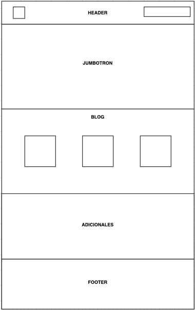

<h1>PROYECTO 1: Landing de Negocio</h1>
**Tabla de Contenido**

[TOC]

Este proyecto está enfocado en construir una página "landing" para un negocio para Bootcam de la UDD.

Se pide que sea una sola página que permita establecer:

- Mensajes del negocio (¿qué se vende?)
- Breve catálogo de productos
- Vista adaptable a móviles

Las secciones siguientes:

<h3>Header<h3/>
  

Sección que involucra el logo y las áreas principales del sitio.

<h3>Jumbotron</h3>

Sección de presentación del producto al usuario. Debe de incluir su título, descripción y un elemento para introducir tu correo.

<h3>Blog o catálogo</h3>

Sección para mostrar los artículos del sitio web. O en su caso, artículos de catálogo de productos

<h3>Adicionales</h3>

Secciones diversas que puedes agregar para dar mayor valor a tu sitio.

<h3>Footer</h3> 

Sección que incluye todas las áreas del sitio, incluyendo redes sociales.
  
<h3>Prototipo del Proyecto</h3>

